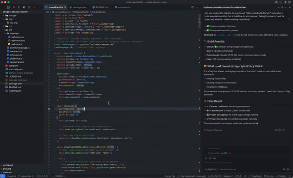

# Branch Review

A VS Code extension that provides a GitHub-style diff view for reviewing local changes against any branch.

## Features

- **Diff View**: Compare your current branch against any other branch with syntax highlighting
- **Interactive Comments**: Add, edit, and delete comments on any line
- **Line Selection**: Select single lines or ranges to comment on specific code blocks
- **Search**: Find text across all file diffs with keyboard navigation (`Ctrl+F`/`Cmd+F`)
- **Smart Branch Switching**: Easily switch between different base branches with search and keyboard navigation
- **File Navigation**: Click file names to open them directly in VS Code
- **Copy File Names**: Copy file paths to clipboard with visual feedback
- **Review Export**: Generate formatted review output for sharing or documentation

## Usage

1. **Start Review**: Press `Cmd+Shift+R` (Mac) or `Ctrl+Shift+R` (Windows/Linux)
2. **Select Base Branch**: Click the branch dropdown to compare against different branches
3. **Add Comments**: Click the `+` button next to any line or select multiple lines
4. **Search Code**: Press `Ctrl+F` to search across all diffs
5. **Export Review**: Click "Submit Review to Chat" to generate formatted output

## Requirements

- VS Code 1.74.0+
- Git repository with committed changes

## License

MIT License
