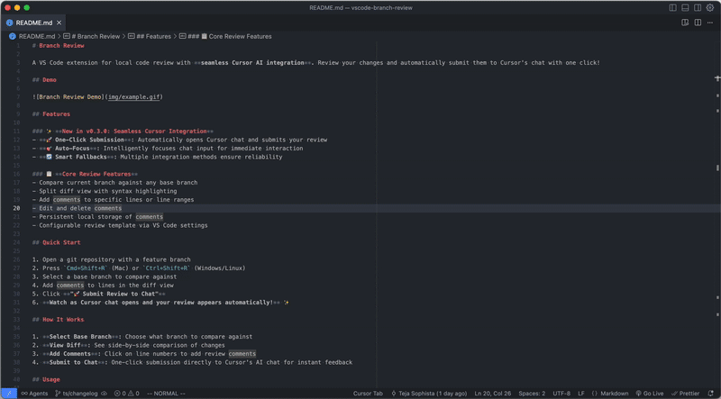

# Branch Review

A VS Code extension that provides a GitHub-style diff view for reviewing changes between branches or uncommitted working directory changes.

## Features

- **Smart Review Modes**: Automatically selects optimal mode (Branch Compare vs Working Changes) based on your current state
- **Intelligent Guidance**: Contextual warnings and suggestions to help you choose the right review mode
- **Dual Review Modes**: Compare branches or review uncommitted changes against HEAD
- **Diff View**: Compare your current branch against any other branch with syntax highlighting
- **Interactive Comments**: Add, edit, and delete comments on any line
- **Line Selection**: Select single lines or ranges to comment on specific code blocks
- **Search**: Find text across all file diffs with keyboard navigation (`Ctrl+F`/`Cmd+F`)
- **Smart Branch Switching**: Easily switch between different base branches with search and keyboard navigation
- **File Navigation**: Click file names to open them directly in VS Code
- **Copy File Names**: Copy file paths to clipboard with visual feedback
- **Review Export**: Generate formatted review output for sharing or documentation

## Usage

1. **Start Review**: Press `Cmd+Shift+R` (Mac) or `Ctrl+Shift+R` (Windows/Linux)
2. **Smart Mode Selection**: The extension automatically selects the optimal review mode based on your uncommitted changes
3. **Switch Modes**: Toggle between "Branch Compare" and "Working Changes" modes with helpful guidance
4. **Select Base Branch**: (Branch Compare mode) Click the branch dropdown to compare against different branches
5. **Add Comments**: Click the `+` button next to any line or select multiple lines
6. **Search Code**: Press `Ctrl+F` to search across all diffs
7. **Export Review**: Click "Submit Review to Chat" to generate formatted output

## Requirements

- VS Code 1.74.0+
- Git repository with committed changes

## License

MIT License
